Configurar Telegram Graphic para Zabbix
=========================================

Debemos tener creador el bot en telegram, tener el codigo API o TOKEN, recuerde que el numero cel que cree el bot sera el dueño de dicho bot.

Tambien hay que estar pendiente cuando exista una actualizacion de Telegram, porque los modulos de "python-telegram-bot" y "pip3.4 install pyTelegramBotAPI" y el mismo python pueden quedar obsoletos.

Ahora tendremos que crear en nuestro telegram un grupo donde agregaremos a todas las personas que necesitamos que sean notificadas, incluyendo al bot que creamos.

Enviaremos un mensaje al grupo que recien hemos creado, le mandamos /token.

Una vez enviado el mensaje debemos optener el id del grupo de telegram. Como lo obtenemos?
En nuestro browser colocaremos el token de acceso que nos proporciono el bot BotFather
https://api.telegram.org/bot327956367:777774Im0333333Q3bhz9I5yfHhvS5RuG_0/getupdates
Con estos dos datos, el token de acceso y el id del grupo comenzaremos a configurar nuestro zabbix

Una vez instalado el API buscaremos la ruta donde estan instalados los script de alertas.::

	# grep -i Alerts /etc/zabbix/zabbix_server.conf
	#	How often Zabbix will try to send unsent alerts (in seconds).
	### Option: AlertScriptsPath
	# AlertScriptsPath=${datadir}/zabbix/alertscripts
	AlertScriptsPath=/usr/lib/zabbix/alertscripts

Ingresamos a la ruta.::

	# cd /usr/lib/zabbix/alertscripts
	
Este script es unicamente para un modo DEBUG, lo llamamos zabbix-debug.sh ::

	#!/bin/bash

	MAIN_DIRECTORY="/usr/lib/zabbix/alertscripts/"

	USER=$1
	SUBJECT=$2
	SUBJECT="${SUBJECT//,/ }"
	MESSAGE="chat_id=${USER}&text=$3"
	GRAPHID=$3
	GRAPHID=$(echo $GRAPHID | awk -F"[" '{print $2}' | tr -d "]")
	ITEMID=$GRAPHID
	ZABBIXMSG="/tmp/zabbix-message-$(date "+%Y.%m.%d-%H.%M.%S").tmp"

	echo "========================================="
	echo "DEBUG: Iniciando script"
	echo "USER: $USER"
	echo "SUBJECT: $SUBJECT"
	echo "GRAPHID: $GRAPHID"
	echo "========================================="

	#############################################
	# CONFIGURACION
	#############################################
	ZBX_URL="https://zabbix.local.com"
	USERNAME="carlos.gomez"
	PASSWORD="Venezuela006"
	BOT_TOKEN='8840777777AFbQTiNLbDePikIabUhZ8zEi5Mgtuwx_Ng'
	ENVIA_GRAFICO=1
	ENVIA_MESSAGE=1

	case $GRAPHID in
		''|*[!0-9]*) ENVIA_GRAFICO=0 ;;
	esac

	WIDTH=800
	CURL="/usr/bin/curl"
	COOKIE="/tmp/telegram_cookie-$(date "+%Y.%m.%d-%H.%M.%S")"
	PNG_PATH="/tmp/telegram_graph-$(date "+%Y.%m.%d-%H.%M.%S").png"

	PERIOD=10800

	if [ "$#" -lt 3 ]
	then
		exit 1
	fi

	############################################
	# Envio Mensagem de Texto - CORREGIDO
	############################################
	echo "DEBUG: Enviando mensaje de texto..."
	echo "$MESSAGE" > $ZABBIXMSG

	# Enviar el asunto (SUBJECT) - CORREGIDO
	${CURL} -k -s -X GET "https://api.telegram.org/bot${BOT_TOKEN}/sendMessage" \
		-d "chat_id=${USER}" \
		-d "text=${SUBJECT}" > /dev/null

	# Enviar el cuerpo del mensaje (MESSAGE) - CORREGIDO
	if [ "$ENVIA_MESSAGE" -eq 1 ]
	then
		${CURL} -k -s -X GET "https://api.telegram.org/bot${BOT_TOKEN}/sendMessage" \
			--data-urlencode "chat_id=${USER}" \
			--data-urlencode "text=$3" > /dev/null
	fi

	############################################
	# Envio dos graficos - METODO CON COOKIES
	############################################
	if [ $(($ENVIA_GRAFICO)) -eq '1' ]; then

		echo "DEBUG: Iniciando sesion con cookies en Zabbix..."

		# Login con cookies
		${CURL} -k -s -c ${COOKIE} -b ${COOKIE} \
			-d "name=${USERNAME}&password=${PASSWORD}&autologin=1&enter=Sign%20in" \
			${ZBX_URL}"/index.php" > /dev/null

		# Verificar si el login fue exitoso (la cookie deberia contener zbx_sessionid)
		if grep -q "zbx_sessionid" ${COOKIE} 2>/dev/null; then
			echo "DEBUG: Login exitoso, cookie creada"
		else
			echo "ERROR: No se pudo iniciar sesion con cookies"
			echo "DEBUG: Intentando metodo alternativo..."

			# Obtenemos token via API
			JSON_AUTH='{"jsonrpc":"2.0","method":"user.login","params":{"username":"'${USERNAME}'","password":"'${PASSWORD}'"},"id":1}'
			AUTH_RESPONSE=$(${CURL} -k -s -X POST ${ZBX_URL}/api_jsonrpc.php \
				-H "Content-Type: application/json-rpc" \
				-d "${JSON_AUTH}")

			echo "DEBUG: Respuesta API: $AUTH_RESPONSE"

			AUTH_TOKEN=$(echo $AUTH_RESPONSE | grep -o '"result":"[^"]*"' | cut -d '"' -f4)

			if [ -n "$AUTH_TOKEN" ]; then
				echo "DEBUG: Token obtenido: ${AUTH_TOKEN:0:20}..."
				# Usamos el token para obtener una cookie de sesion
				${CURL} -k -s -c ${COOKIE} -b ${COOKIE} \
					-H "Authorization: Bearer ${AUTH_TOKEN}" \
					${ZBX_URL}"/index.php" > /dev/null
				echo "DEBUG: Cookie creada con token"
			else
				echo "ERROR: No se pudo obtener token"
			fi
		fi

		# URL del grafico
		GRAPH_URL="${ZBX_URL}/chart.php?itemids%5B%5D=${GRAPHID}&period=${PERIOD}&width=${WIDTH}"
		echo "DEBUG: URL del grafico: $GRAPH_URL"

		# Descargar grafico con cookies
		echo "DEBUG: Descargando grafico con cookies..."
		${CURL} -k -s -b ${COOKIE} -X GET "${GRAPH_URL}" -o "${PNG_PATH}"

		# Verificar tamañel archivo
		FILE_SIZE=$(stat -c%s "${PNG_PATH}" 2>/dev/null || echo "0")
		echo "DEBUG: Tamañel archivo PNG: $FILE_SIZE bytes"

		# Verificar si es PNG valido
		if [ -f "${PNG_PATH}" ] && [ "$FILE_SIZE" -gt 100 ]; then
			FILE_TYPE=$(file -b --mime-type "${PNG_PATH}" 2>/dev/null || echo "desconocido")
			echo "DEBUG: Tipo MIME: $FILE_TYPE"

			if [[ "$FILE_TYPE" == "image/png" ]]; then
				echo " SUCCESS: El archivo es una imagen PNG valida"

				# Enviar a Telegram
				echo "DEBUG: Enviando imagen a Telegram..."
				RESPONSE=$(${CURL} -k -s -X POST "https://api.telegram.org/bot${BOT_TOKEN}/sendPhoto" \
					-F chat_id="${USER}" \
					-F photo="@${PNG_PATH}")

				echo "DEBUG: Respuesta de Telegram: $RESPONSE"

				# Verificar si Telegram recibio la imagen
				if echo "$RESPONSE" | grep -q '"ok":true'; then
					echo " SUCCESS: Imagen enviada correctamente a Telegram"
				else
					echo " ERROR: Telegram rechazo la imagen"
					echo "DEBUG: Verificando archivo..."
					file "${PNG_PATH}"
					ls -lh "${PNG_PATH}"
				fi
			else
				echo " ERROR: El archivo no es una imagen PNG. Tipo: $FILE_TYPE"
				echo "DEBUG: Contenido del archivo (primeros 200 bytes):"
				head -c 200 "${PNG_PATH}"
				echo ""
				echo "DEBUG: Probando metodo alternativo con autenticacion basica..."

				# Ultimo intento: autenticacion basica
				${CURL} -k -s -u "${USERNAME}:${PASSWORD}" \
					-X GET "${GRAPH_URL}" -o "${PNG_PATH}"

				FILE_TYPE=$(file -b --mime-type "${PNG_PATH}" 2>/dev/null || echo "desconocido")
				echo "DEBUG: Nuevo tipo MIME: $FILE_TYPE"

				if [[ "$FILE_TYPE" == "image/png" ]]; then
					echo " SUCCESS: Descargado con autenticacion basica"
					${CURL} -k -s -X POST "https://api.telegram.org/bot${BOT_TOKEN}/sendPhoto" \
						-F chat_id="${USER}" \
						-F photo="@${PNG_PATH}" > /dev/null
					echo " SUCCESS: Imagen enviada"
				else
					echo " ERROR: No se pudo descargar la imagen con ningun metodo"
				fi
			fi
		else
			echo " ERROR: El archivo PNG esta vacio o no existe"
			echo "DEBUG: Contenido del archivo (primeros 200 bytes):"
			head -c 200 "${PNG_PATH}" 2>/dev/null || echo "No se puede leer el archivo"
		fi
	fi

	echo "========================================="
	echo "DEBUG: Script finalizado"
	echo "========================================="

	############################################
	# Limpieza
	############################################
	rm -f ${COOKIE}
	rm -f ${PNG_PATH}
	rm -f ${ZABBIXMSG}

	exit 0

Procederemos a crear el siguiente script que enviara la informacion al grupo de telegram por medio del bot. este script el autor original es de "https://github.com/diegosmaia/zabbix-telegram" pero coloco este porque fue modificado para la version de ZABBIX 2.2.::

	#!/bin/bash

	##########################################################################
	# Zabbix-Telegram envio de alerta por Telegram com graficos dos eventos
	# Version: 7.0
	# Compatible con Zabbix 7.0
	##########################################################################

	MAIN_DIRECTORY="/usr/lib/zabbix/alertscripts/"

	USER=$1
	SUBJECT=$2
	SUBJECT="${SUBJECT//,/ }"
	MESSAGE="chat_id=${USER}&text=$3"
	GRAPHID=$3
	GRAPHID=$(echo $GRAPHID | awk -F"[" '{print $2}' | tr -d "]")
	ITEMID=$GRAPHID
	ZABBIXMSG="/tmp/zabbix-message-$(date "+%Y.%m.%d-%H.%M.%S").tmp"

	#############################################
	# CONFIGURACION - MODIFICAR SEGUN SU ENTORNO
	#############################################
	ZBX_URL="https://zabbix.credicard.com.ve"
	USERNAME="carlos.gomez"
	PASSWORD="Venezuela006"
	BOT_TOKEN='8840777777AFbQTiNLbDePikIabUhZ8zEi5Mgtuwx_Ng'
	ENVIA_GRAFICO=1
	ENVIA_MESSAGE=1

	##############################################
	# PARAMETROS DEL GRAFICO
	##############################################
	WIDTH=800
	PERIOD=10800  # 3 horas en segundos

	#############################################
	# NO MODIFICAR DEBAJO DE ESTA LINEA
	#############################################
	case $GRAPHID in
		''|*[!0-9]*) ENVIA_GRAFICO=0 ;;
	esac

	CURL="/usr/bin/curl"
	COOKIE="/tmp/telegram_cookie-$(date "+%Y.%m.%d-%H.%M.%S")"
	PNG_PATH="/tmp/telegram_graph-$(date "+%Y.%m.%d-%H.%M.%S").png"

	if [ "$#" -lt 3 ]
	then
		exit 1
	fi

	############################################
	# Envio Mensaje de Texto
	############################################
	echo "$MESSAGE" > $ZABBIXMSG

	# Enviar el asunto (SUBJECT) - CORREGIDO
	${CURL} -k -s -X GET "https://api.telegram.org/bot${BOT_TOKEN}/sendMessage" \
		-d "chat_id=${USER}" \
		-d "text=${SUBJECT}" > /dev/null

	# Enviar el cuerpo del mensaje (MESSAGE)
	if [ "$ENVIA_MESSAGE" -eq 1 ]
	then
		${CURL} -k -s -X GET "https://api.telegram.org/bot${BOT_TOKEN}/sendMessage" \
			--data-urlencode "chat_id=${USER}" \
			--data-urlencode "text=$3" > /dev/null
	fi

	############################################
	# Envio del Grafico
	############################################
	if [ $(($ENVIA_GRAFICO)) -eq '1' ]; then

		# Login con cookies
		${CURL} -k -s -c ${COOKIE} -b ${COOKIE} \
			-d "name=${USERNAME}&password=${PASSWORD}&autologin=1&enter=Sign%20in" \
			${ZBX_URL}"/index.php" > /dev/null

		# Si el login con cookies falla, intentar con API
		if ! grep -q "zbx_sessionid" ${COOKIE} 2>/dev/null; then
			# Obtener token via API
			JSON_AUTH='{"jsonrpc":"2.0","method":"user.login","params":{"username":"'${USERNAME}'","password":"'${PASSWORD}'"},"id":1}'
			AUTH_TOKEN=$(${CURL} -k -s -X POST ${ZBX_URL}/api_jsonrpc.php \
				-H "Content-Type: application/json-rpc" \
				-d "${JSON_AUTH}" | grep -o '"result":"[^"]*"' | cut -d '"' -f4)

			# Usar token para obtener cookie de sesion
			${CURL} -k -s -c ${COOKIE} -b ${COOKIE} \
				-H "Authorization: Bearer ${AUTH_TOKEN}" \
				${ZBX_URL}"/index.php" > /dev/null
		fi

		# Construir URL del grafico
		GRAPH_URL="${ZBX_URL}/chart.php?itemids%5B%5D=${GRAPHID}&period=${PERIOD}&width=${WIDTH}"

		# Descargar grafico
		${CURL} -k -s -b ${COOKIE} -X GET "${GRAPH_URL}" -o "${PNG_PATH}"

		# Verificar que el archivo sea una imagen PNG valida
		FILE_TYPE=$(file -b --mime-type "${PNG_PATH}" 2>/dev/null || echo "desconocido")

		if [[ "$FILE_TYPE" == "image/png" ]]; then
			# Enviar imagen a Telegram
			${CURL} -k -s -X POST "https://api.telegram.org/bot${BOT_TOKEN}/sendPhoto" \
				-F chat_id="${USER}" \
				-F photo="@${PNG_PATH}" > /dev/null
		else
			# Si falla, intentar con autenticacion basica
			${CURL} -k -s -u "${USERNAME}:${PASSWORD}" \
				-X GET "${GRAPH_URL}" -o "${PNG_PATH}"

			FILE_TYPE=$(file -b --mime-type "${PNG_PATH}" 2>/dev/null || echo "desconocido")

			if [[ "$FILE_TYPE" == "image/png" ]]; then
				${CURL} -k -s -X POST "https://api.telegram.org/bot${BOT_TOKEN}/sendPhoto" \
					-F chat_id="${USER}" \
					-F photo="@${PNG_PATH}" > /dev/null
			fi
		fi
	fi

	############################################
	# Limpieza de archivos temporales
	############################################
	rm -f ${COOKIE}
	rm -f ${PNG_PATH}
	rm -f ${ZABBIXMSG}

	exit 0

Modificar el valor de variable ZBX_URL para o ip del servidor Zabbix.::

	############################################# 
	# Endereço do Zabbix 
	############################################# 
	ZBX_URL="http://192.168.1.6/zabbix" 

Modificar o las variables de USERNAME Y PASSWORD con la de un usuario valido en ZABBIX.::

	############################################## 
	# Conta de usuário para logar no site Zabbix 
	############################################## 
	USERNAME="carlos.gomez" 
	PASSWORD="Venezuela21" 

Colocar el valor del TOKEN de su bot en la variable BOT_TOKEN.::

	############################################ 
	# O Bot-Token do exemplo, tem que modificar 
	############################################ 
	BOT_TOKEN='327956367:777774Im0333333Q3bhz9I5yfHhvS5RuG_0' 

Cambiar estos valores si no quieren que se envien los Graficos o Mensajes.::

	############################################# 
	# Se nao desejar enviar GRAFICO / ENVIA_GRAFICO = 0 
	# Se nao desejar enviar MESSAGE / ENVIA_MESSAGE = 0 
	############################################# 
	ENVIA_GRAFICO=1 
	ENVIA_MESSAGE=1

Si queremos aumentar el tamaño del gráfico.::

	############################################## 
	# Graficos 
	############################################## 
	WIDTH=800 

Caso quira aumentar el período del gráfico de 3h.::

	############################################ 
	# Periodo do grafico em minutos Exp: 10800min/3600min=3h 
	############################################ 
	PERIOD=10800 

Probar antes el script, si no funciona NO continuar.
+++++++++++++++++++++++++++++++++++++++++++++++++++++++

Abrir Zabbix browser en la opcion “Monitoring → Latest Data” buscamos cualquier servidor y abrimos un grafico que tenga data.:

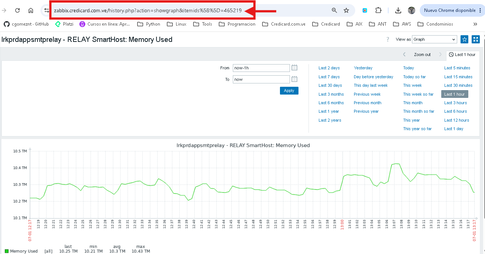

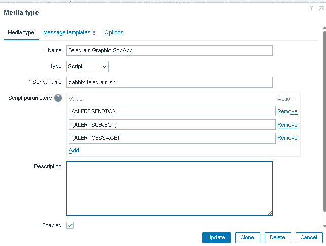

http://192.168.1.6/zabbix/history.php?action=showgraph&itemid=24152&sid=4c6d26afc44a5b18

El comando para verificar es.::

	zabbix-telegram.sh Group-ID Subject "Item Graphic: [graficoID]"

	[root@lrkprdappzab01 alertscripts]# ./zabbix-telegram.sh -5532136968 " Test de Prueba" "Item Graphic: [465219] "

Hemos comprobado que el script esta trabajando correctamente, ahora a configurar via web zabbix para que envie las alarmas via telegram.

Media type
+++++++++++

En la interfaz de Zabbix ir, go to Adminstration, Media types, y click en Create media type.

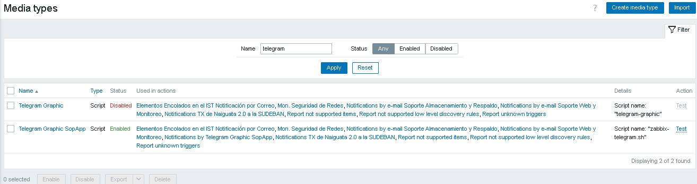

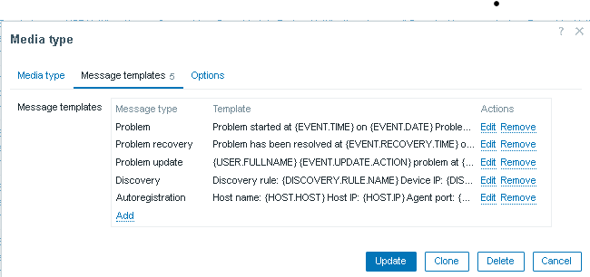

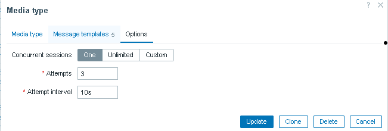

.::

	Name: Telegram Graphic SopApp
	Type: Script
	Script name: zabbix-telegram.sh

	Si usamos Zabbix 7.0:

	Script Parameters
	{ALERT.SENDTO}
	{ALERT.SUBJECT}
	{ALERT.MESSAGE}

Trigger Actions
++++++++

Ahora ir a Alerts, Action, Trigger Actions y click en Create Action.

.::

	Name: Notifications by Telegram Graphic SopApp
	Default Subject: #{HOSTNAME}: {TRIGGER.NAME} {TRIGGER.STATUS}
	Default Message:
	Item Graphic:[{ITEM.ID1}]

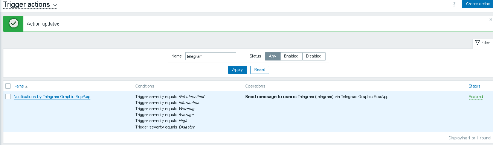

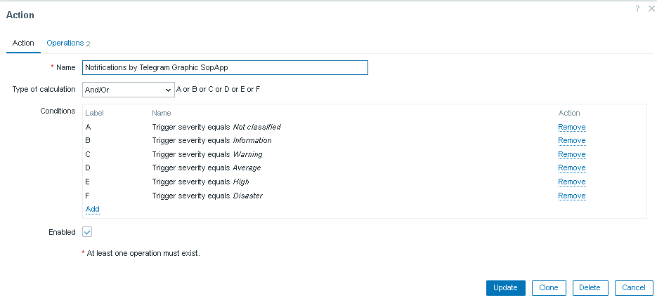

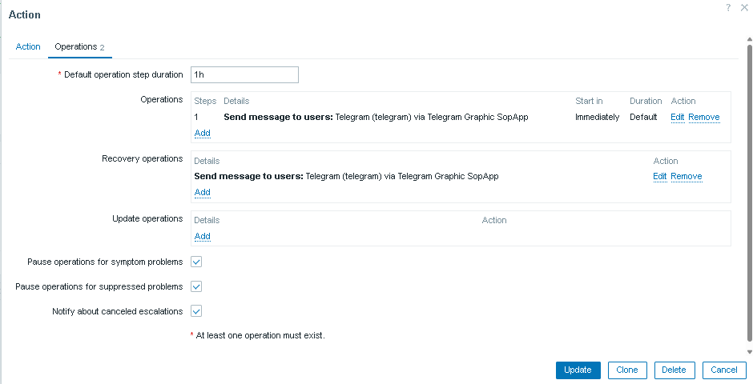

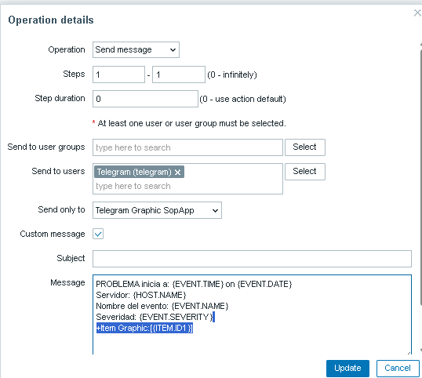

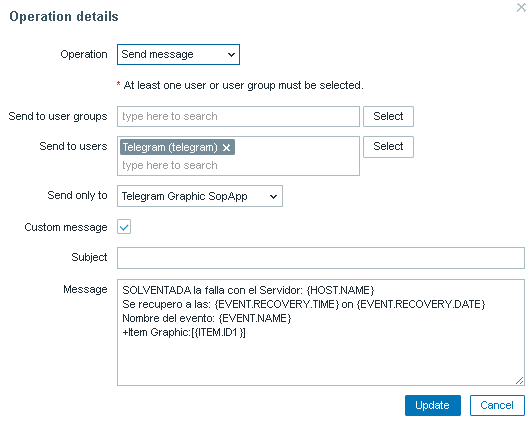

Users
+++++++

El ultimo paso es crear un usuario de solo lectura para que pueda recibir las alertas de los triggers y que se envie a la media que se creo para Telegram.

Ir a Administration, Users y seleccionar el usuario. Entonces, ir a Media y click en Add.::

	Type: telegram
	Send to: ID | Telegram ID es es el valor que ya capturamos al principio.

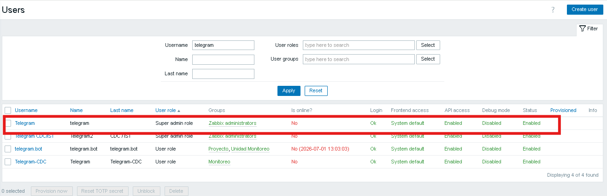

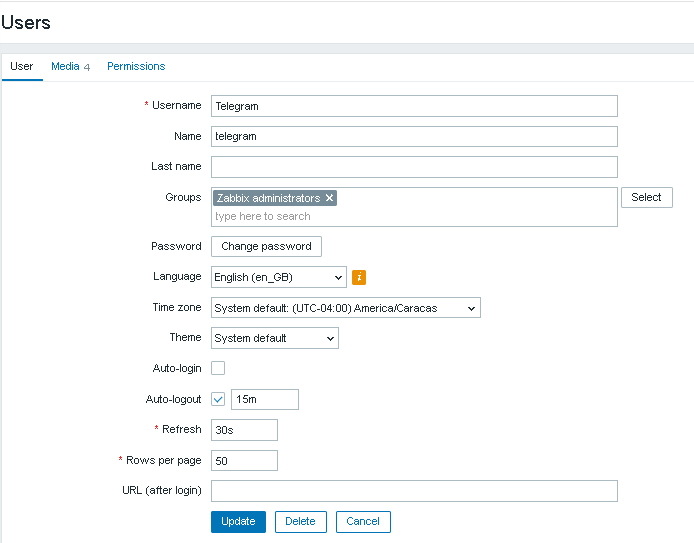

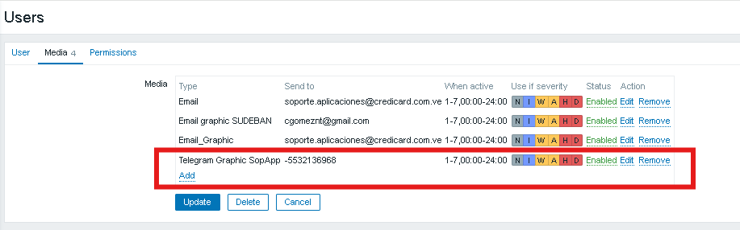

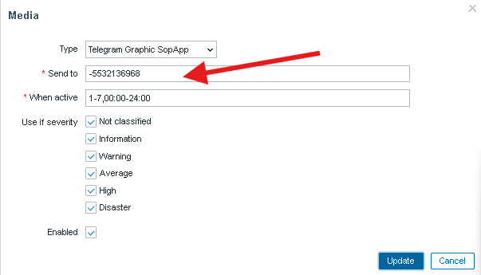

Listo ya ahora todos los triggers que se activen seran enviados al Grupo del Telegram. Recuerda que en Action pueden crear action mas especificos, es decir, para que solo envie los mensajes de ciertos triggers o de servidores o de grupos.

